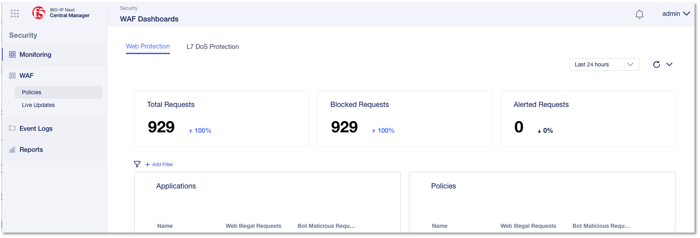

BIG-IP Next WAF Advanced Dashboardとは
======================================

WAF Advanced ダッシュボードは、アプリケーションの Web 保護と L7 DoS 保護の概要を簡単に提供します。ダッシュボードを使用すると、現在の保護設定に基づくポリシーの有効性を確認できます。

トラフィック動作の変化や時間の経過とともに検出される攻撃の増加は、誤検知、またはポリシー設定の変更が必要な予期せぬ脆弱性を示している可能性があります。

ダッシュボードは、保護されたアプリケーションへのトラフィックに関する最新情報を表示します。ダッシュボードの時間設定を変更して、過去 5 分間または最大で過去 30 日間のトラフィックと検出された攻撃に焦点を当てることができます。さらに、ダッシュボード内の情報をフィルタリングして、特定のアプリケーション、WAF ポリシー、または攻撃データに焦点を当てることができます。

WAF Advanced ダッシュボード内では、アプリケーション保護を監視する 2 つの方法があります。

Web プロテクション - すべての保護されたアプリケーションのトラフィック情報と、トラフィック メタデータに基づいた検出された攻撃の視覚的な分析を単一画面で提供します。たとえば、悪意のあるIP アドレスと検出された攻撃シグネチャを表示します。

L7 DoS 保護 - 保護されたアプリケーション、そのトラフィック ステータス (ストレス レベル)、および検出された L7 DoS 攻撃の潜在的な影響の分析を表示します。

