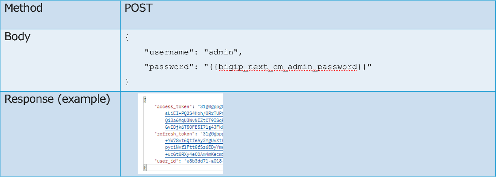

APIへのログインと認証トークン取得
=========================================================

独自の API 呼び出しを送信するには、任意の HTTP クライアント (Postman など) を使用し、API 呼び出しの例に概説されている構文に従っていることを確認してください。

BIG-IP Next Central Manager API で認証するには、まず管理者ロールと適切なパスワードによる基本認証を使用して認証トークンを取得します。

 /api/login エンドポイントに Post を送信します。

.. note::
   
   ＊タイムアウトにより再度取得する必要があります

.. list-table:: APIへのログインと認証トークン取得
   :widths: 25 50
   :header-rows: 0

   * - API Endpoint
     - https://{{bigip_next_cm_mgmt_ip}}/api/login

 

|

